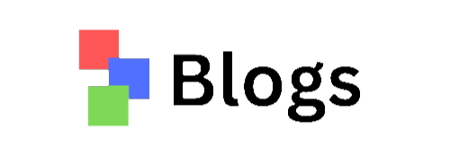

<p align="center">
  
</p>
# 📝 Blogs

A full-stack blog website built with **React**, **Node.js**, and **MongoDB** where users can create, edit, and view blogs. Authenticated users can upload images and manage their posts.

## 📁 Project Structure

## 🚀 Features

- 📰 View blogs from other users
- ✍️ Create and edit your own posts
- 📸 Upload images to your blogs
- 🔐 Login & Signup with authentication
- 🧠 MongoDB Atlas integration

---

## 🛠️ Setup Instructions

### 1. Clone the repository

```bash
git clone https://github.com/ameyahire/Blogs-Web.git
cd Blogs-Web

```
### 2. Setup Backend

```bash
cd api
npm install
```

Create a .env file in the api folder and add the following:
```bash
MONGODB_URI=your_mongodb_connection_uri
```

Then start the backend:
```bash
nodemon start
```

###3. Setup Frontend (Client)
```bash
cd ../client
npm install
npm start
```

The frontend will run on http://localhost:3000 The backend runs on http://localhost:5000 (or whatever port you specify)

